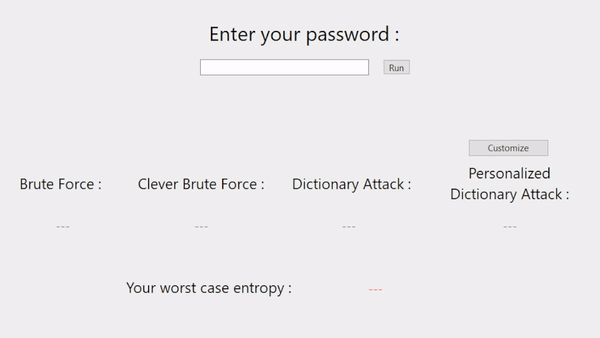

# How Entropic Am I ?

This is a short project designed to show people 
how safe their passwords (or password ideas) are 
through the metric of [information entropy](https://en.wikipedia.org/wiki/Entropy_(information_theory)).

This is a hobby application meant for illustrative purposes and, as such, 
the entropy amounts may not be perfectly computed. A more 
reliable source (like the KeePassXC application) should be used 
as a double check for important tests.

DISCLAIMER : This application does **not** connect to the internet,
and in no way shares any information entered. Still, you probably
shouldn't put your real passwords in as a matter of general opsec.

# But what is entropy ? 
Entropy is a measure of how hard a given password
is to guess. "Guessing" here can refer to a range of methods from brute force
to more intelligent approaches.

In other words, the higher the entropy, the more secure the password.

The [Keepass Help Center](https://keepass.info/help/kb/pw_quality_est.html) website provides the following chart for the relationship between password entropy and "quality" : 
| **Bits** | **Strength** |
|----------|--------------|
| 0-64     | Very weak    |
| 64-80    | Weak         |
| 80-112   | Good         |
| 112-128  | Strong       |
| ≥ 128    | Very strong  |

# How does it work ?
Simply enter your password, and click run to see your entropy with respect to some of the main password-cracking methods. 

You can also answer some personal questions in the "Customize" tab to see how hackers can use specific knowledge against you.

  

